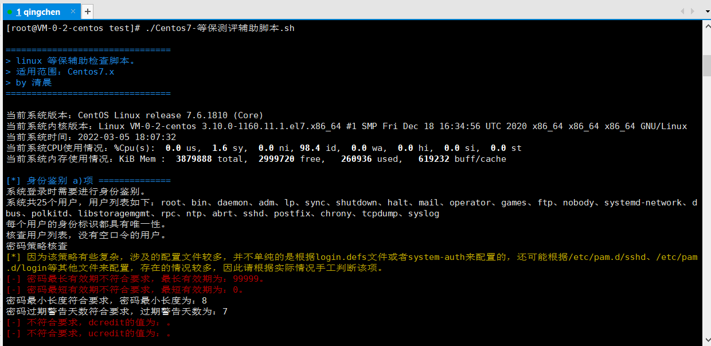

# 前言

这个工具呢。怎么说呢。就练手吧也是。

我之前的想法是这样的其实，就是根据结果生成测评记录，就是填在测评表格里的那种。

测评记录是有套话可以照着填上去的，而且每个系统测评的内容大概都是那些。

这里简单的说一下我一开始的构想。

原先我是想用一个python来写的一个b/s架构。

怎么弄呢？就是单纯的就是一个python程序，只要运行python程序就可以访问一个本地网页，然后通过网页来操作。去掉这些数据库啥的乱七八糟的东西。方便其他人拿去使用。

进去首页肯定是要登录，然后登录进去就是新建一个测评项目，就有一个很单纯的界面，新建项目的按钮。

然后建完项目以后就开始测评，选测评对象（有机房、网络设备、安全设备、Linux服务器、Windows服务器、应用系统等等。），一开始是从机房的物理环境开始，因为这些东西不像是代码，所以我的想法就是表单，比如是否有防盗的表单选项，选了有下面就出现一个文本框，防盗门是什么牌子啥的可以选填。然后依次下去。根据测评项进行下去，结束了就生成一个excel的测评记录出来，然后就是下一步，选择测评对象，这里就会出现什么网络设备、安全设备这些，比如这次选的是网络设备，然后下一步就是选版本，华为还是思科，在下一步就是第一个测评的是身份鉴别，密码策略。出来一体条提示，请根据输入以下命令，把命令结果粘贴到文本框中。即便是不懂技术的人也可以根据提示一步一步测完一个项目。生成测评记录。Linux也是类似，windows也是类似，比如密码策略这里，提示控制面板”-》“管理工具”-》“本地安全策略”-》“账户策略”-》“密码策略”选项查看密码策略。然后选择表单，表单就根据windows的那几个密码策略放在哪里。有没有勾上就行了。测完也是生成一个Windows的测评记录。

但是仔细想想其实这个开发挺复杂的。至少对于我这个菜鸟来说是这样的。我还想了很多比如生成了记录那能不能顺便把问题清单生成了直接丢给用户让他们去改。再比如三级系统和二级不一样的，测评指标不一样，生成的记录肯定不一样有些三级是高危，二级不是。

所以我就放弃了。试试自己随便写一个centos7的脚本，放到这里的套话已经被我改过了，没办法我套话是公司的。

说实话这个脚本其实挺鸡肋的，先不说有些用户允不允许上传脚本到服务器。就算允许人家系统也不是centos7，就算是centos7也不一定支持中文。你可以看到我的echo结果都是中文的。没办法测评记录不可能是英文的。

而且我英文很菜。

最后还是要说一下。如果大佬看到我这个小菜鸟的东西辣眼睛，请绕行。别骂我就行。

# 工具使用

```
./Centos7-等保测评辅助脚本.sh
```




因为部分信息还是需要人工核对，比如是否安装了多余的软件，是否启用了多余的服务，是否安装了防病毒软件等等。甚至是Linux的管理IP地址限制，除了/etc/hosts.deny和/etc/hosts.allow这些文件可以限制以外，还可以使用防火墙限制，限制是否合理都需要人为判断。

因此脚本最后还会把查看的对象的原始内容保存一份到脚本的当前目录中，以便人工核查。


